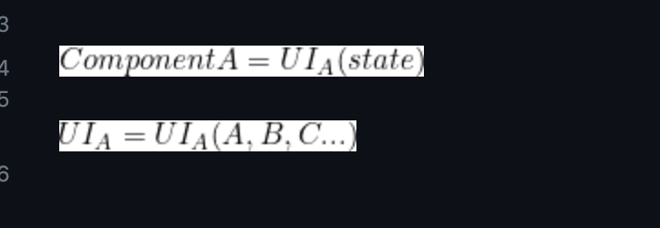

주: 해당 글은 프론트엔드 개발에서 사용하는 컴포넌트 개념을 기준으로 작성됩니다.
### 지난 화 줄거리
컴포넌트를 정확하게 두 요소로 분리해주세요.
```A + B = "컴포넌트"```
많은 키워드가 나오기 시작했다... 
(궁금하면 이전 글을 참고하시오)

항상 꼬리가 꼬리를 무는 기술 얘기는 모두의(?) 기분을 좋게 만든다.
컴포넌트를 논할 때 UI(화면)와 State(상태) 라는 키워드가 계속 등장했는데, 
필자는 상태관리와 컴포넌트 간의 어떤 연관관계가 있을지 문득 궁금해졌다.

<!-- truncate -->
```
도원:
결국 컴포넌트는 "상태" 라는 키워드를 벗어날 수 없는 것 같아요.
화면을 그려주는 코드 + 화면 데이터를 처리하는 코드 (aka 비즈니스 로직)
보편적으로 이 두가지 요소로 컴포넌트를 바라볼 수 있는 것 같네요.

그렇다면 상태관리를 잘 한다는 건 어떤 의미일까요?
ex: "화면을 잘 그려주고, 화면에 보여줄 데이터를 잘 처리한다".
```
수많은 JD에서 "능숙한 상태관리 경험이 있으신 분"이라는 본적이 있다. 잘하는 프론트엔드 개발자에게
상태관리를 잘하는 건 너무 당연한 일이기 때문이다. 그렇다면 상태관리라는 개념을 분석해볼 가치가 있다고 생각했다.

--------

## 1차토론 - 보성 & 도원

보성:
상태 관리를 잘한다라... 상태의 흐름이 예측 가능하면 좋은 상태 관리 아닐까요? 
전역 상태 대신에 프롭스 드릴링 같은 단방향 구조가 추적하기 쉽고 예측하기 쉽듯이,
어떤 상태의 이전과 다음의 상태들이 예측 가능한 구조들이라면 괜찮은 상태가 아닐까.

도원: "좋은 상태관리 흐름/구조를 만들 수 있다"로 이해하면 될까요? 

보성: 네 이해하신바가 정확합니다.

도원: 
그렇다면 컴포넌트 입장에서 "상태관리를 잘한다"는 어떤 개념으로 다가가면 될까요, 
바꿔서 질문하자면 컴포넌트를 사용하는데, 왜 상태관리를 잘해야할까요? (발제1)

### 왜 상태관리를 잘해야하는가?

보성: 
컴포넌트가 상태에 강하게 의존하고 있으니까 아닐까요, 바꿔 말하자면 컴포넌트를 관리하는 상태가 
예측 불가능하면 예측 불가능한 컴포넌트가 되어버리는거죠.

도원: 예측 불가능한 컴포넌트는 버려질까요?

보성: 예측 불가능한 컴포넌트를 사용하는 서비스는 버려질 것 같아요.

도원: 
예측 불가능하게 구현된 컴포넌트는 애초에 "컴포넌트" 로서의 가치가 떨어진다는 얘기군요.
프로젝트 리소스 로서 가치가 떨어지니깐, 그럼 상태관리를 해준다는건, "컴포넌트들을 관리하는 것"과 
동일 시 할 수 있겠어요. 물이 고이지 않고, 공기를 순환시키듯이.

보성: 어렵네요 두 가지를 분리하는게

도원: 뭔가 애매한 어딘가에 걸쳐있는 느낌이에요.

보성: "하나의 컴퍼넌트의 지역적인 상태인가, 컴퍼넌트끼리 전달되는 shared한 상태인가" 가 중요할 것 같기도하네요.

깜짝 등장한 준호: 상태에 벗어날수 있죠! 헤드리스! 일부러 벗어나게 의도한거지만, 프롭스로 받는것도 상태라고 취급하면…종속된다고 볼수있지만.

도원: 상태라는 개념에서 파생된 내용이기에 벗어나기 어렵다라고 표현해봤어요. "상태 안떠오르기" 는 불가능 하니깐요.

다시 사라지는 준호: 상태 vs 안상태...

도원: (보성의 local/shared 글을 멘션하며) local / global / lexical 은 뭔가 결국 "상태" 라는 속성이 컴포넌트에 존재하고 있다는거잖아요?
```aiignore
Component {
	state: local / global / lexical ?
}
```
도원: 속성 값 관리를 누구에게 위임할거냐, 재무를 개인 회계사에게 맡길거냐, 직접 할거냐, 요런 느낌.
(만지작 대며 코드를 수정한다)
```aiignore
Component {
	UI : UI(state) + stateless UI
	상태: local / lexical / global
}
```
도원: 결국 그건가. `UI(state) = Component`

보성: 그렇죠, 함수로도 표현할 수 있지만, 그림으로 표현하면 말씀하신것처럼 다양한 범위로 관리되는 상태를 가지고 UI를 그려내는 그런 모습이 보이네요.

혼잣말을 하는 도원: 프론트엔드의 역할이 단순히 데이터를 보여주는게 아니라 유저의 context(맥락 또는 행동)을 추적하고, 지속적으로 서비스를 제공하는 행위를...
말하다 보니까 뭔가 복잡하네요.

### 렌더링에 멱등성이 있다?
도원: 리렌더링엔 멱등성이 있네요. http 통신처럼, 렌더링 마다 멱등성이 파괴되는걸 목격하게 될거고 클래스 컴포넌트가 도태되는것도 이해가 되네요.

보성: 정확하게 따지면 멱등성이 있는데, 그 컴퍼넌트가 상태를 바꾸는 이펙트를 호출하는 컴퍼넌트라면 멱등성이라고 하기엔 또 모호해지는, view에 보일때마다 조회수가 1씩 올라가는 컴퍼넌트라면…

도원: 그럼 그 컴포넌트는 컴포넌트가 아니라 모델이나 뭐 어디쯤 되는 친구 아닐까요.

도원: 이건 어때요, 렌더링과 이펙트를 명확히 분리하지 않아 발생하는 멱등성 상실.

보성: 어렵네요 이해가.. 그런데 제가 조금 잘못되게 표현한 것 같기도해요. 결국 렌더링은… 음 아니다

도원: 편하게 얘기해주세요.

보성: 리렌더링은 멱등성을 띄는게 맞는지 아닌지가 가장 관건이네요. 애초에 표현이 맞는지가 헷갈려요. 렌더링을 멱등성을 가진다 가 아니라 리렌더링이니까 더 고민하게되네요.


도원: 렌더링으로 시정하겠습니다. 원래 궁금했던 것도 "렌더링의 멱등성"이라.

보성: 상태가 아니라 시간에 의존하는 컴포넌트라면? new Date를 toLocale 같은 메서드로 화면에 보여주는 값이 있다면?
그런데 다시 렌더링으로 돌아오게 된다면 안에서 의존하는 값 (useQuery의 data등도 결국 state일테니) 과 props로 내려주는 값이 똑같다면
똑같이 렌더되겠지요? 근데 상태는 완전히 똑같은 값을 받았는데 내 부모 컨테이너의 넓이가 커지거나 작아지거나해서 리페인팅 될때 작아지거나 커졌다면?
그것도 멱등성이라고 봐야하는가?

도원: 컴포넌트 끼리 서로 렌더링 기능을 의존하고 있는 상황을 말씀하시는 거군요

보성: 그렇죠, 상태에만 의존한다고 생각했는데, 심지어 상태가 똑같더라도 렌더링은 다르게 될 수 있네요.
nth-child같은 요소에 의해서 다르게 칠해질 수 도 있고 부모 넓이에 영향을 받을 수도 있고.

도원: 렌더링 함수가 영향을 받는걸까요, 아니면 컴포넌트의 state(nth 요소? 부모의 크기?) 가 바뀌는걸까요?

보성: state가 바뀌는 것은 아닌 것 같습니다.




<-- 작성 중 -->